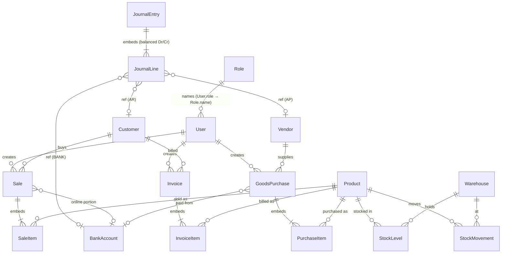

# Database & ER Diagram

MongoDB via Mongoose. Models live in [`backend/src/models`](../backend/src/models).
There is no migration step — collections and indexes are created on first use.
**All money is stored as integer paisa** (₨1 = 100); quantities are plain numbers.

## ER Diagram (Mermaid)

References are Mongoose `ObjectId` refs unless noted. `*Item`/`line` entities are
**embedded sub-documents**, not separate collections.

## Entity catalogue

Collections actually present (14):

| Group             | Collections (Mongoose models)                             |
| ----------------- | --------------------------------------------------------- |
| Identity & access | `User`, `Role`                                            |
| Catalog           | `Product`                                                 |
| Warehousing       | `Warehouse`, `StockLevel`, `StockMovement`                |
| Partners          | `Vendor`, `Customer`                                      |
| Purchasing (GP)   | `GoodsPurchase` (embeds `items[]`)                        |
| Sales / POS       | `Sale` (embeds `items[]`)                                 |
| Billing           | `Invoice` (embeds `items[]`)                              |
| Finance           | `JournalEntry` (embeds balanced `lines[]`), `BankAccount` |
| System            | `Counter` (atomic document numbering)                     |

> Catalog metadata that the original design split into tables is **denormalized
> onto `Product`** as plain string fields: `category`, `unit`, `sku`, `barcode`.
> There are **no** `Category`/`Brand`/`Unit`, `RefreshToken`, `AuditLog`,
> `OrderTicket`, `CashTransaction`/`BankTransaction`, `PasswordResetToken`,
> `CompanySetting`/`PrintTemplate`/`Notification`, or `NumberSequence`
> collections. Password-reset fields live (hashed) on `User`; cash & bank
> movements are `JournalEntry` lines; document numbering is the `Counter`
> collection.

## Modelling notes

- **Money** is integer **paisa** throughout (`Number`). `utils/money.js` does the
  arithmetic; rupees appear only at the serialization/display boundary.
- **Roles are data, not an enum.** `User.role` is a string referencing
  `Role.name`. The five built-in roles — `cashier`, `accountant`, `manager`,
  `admin`, `super_admin` — are seeded with `isSystem: true`; `super_admin` carries
  the `"*"` permission wildcard.
- **Stock.** `StockMovement` (`type: IN | OUT | ADJUST`, signed `quantity`,
  `unitCost`) is the append-only audit trail; `StockLevel` is the denormalized
  current `quantity` + moving-average `avgCost` per `(product, warehouse)`
  (unique index). `quantity * avgCost` is the inventory value used by the Stock
  Valuation report.
- **Ledger = single-document double entry.** Each `JournalEntry` embeds its
  balanced `lines[]`; a schema validator enforces ≥2 lines, exactly one of
  `debit`/`credit` non-zero per line, and `SUM(debit) === SUM(credit)`. Account
  kinds: `CASH, BANK, INVENTORY, AR, AP, SALES, COGS, TAX, EQUITY`. `AR`/`AP`/
  `BANK` lines carry a `ref` to the Customer/Vendor/BankAccount. **No running
  balance is stored** — balances are derived by aggregating lines (`naturalBalance`
  applies each account's debit/credit-normal sign).
- **Document numbers** are gapless and per-year via the atomic `Counter`
  (`SALE-2026-000010`, `GP-2026-0002`, `INV-2026-000001`).
- **Derived party balances.** `Customer.outstanding` / `Vendor.outstanding` are
  read-only convenience fields maintained by the sale/purchase/payment flows; the
  authoritative receivable/payable is the AR/AP ledger.
- **Soft state:** `isActive` flags on `Product`, `Warehouse`, `BankAccount`;
  users are deactivated rather than hard-deleted in normal flows.

## Useful indexes

- `User.email` (unique), `User.role`
- `Product.sku` (unique, partial — blanks allowed), `Product.name`
- `StockLevel` `{ product, warehouse }` (unique)
- `Sale.number` / `GoodsPurchase.number` / `Invoice.number` (unique), plus
  `customer`/`vendor` and `date` indexes for listings
- `JournalEntry` `{ "lines.account", "lines.ref", date }`, `refType`, `refNo`
- `Counter` `{ key, scope }` (unique)
