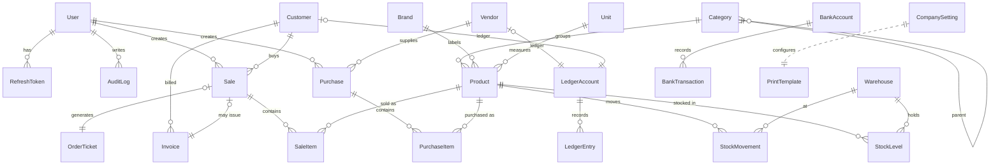

# Database & ER Diagram

PostgreSQL via Prisma. Full schema: [`backend/prisma/schema.prisma`](../backend/prisma/schema.prisma).

## ER Diagram (Mermaid)



## Entity catalogue

| Group             | Tables                                                                                         |
| ----------------- | ---------------------------------------------------------------------------------------------- |
| Identity & access | `users`, `refresh_tokens`, `password_reset_tokens`, `audit_logs`                               |
| Catalog           | `categories`, `brands`, `units`, `products`                                                    |
| Warehousing       | `warehouses`, `stock_levels`, `stock_movements`                                                |
| Partners          | `vendors`, `customers`                                                                         |
| Purchasing (GP)   | `purchases`, `purchase_items`                                                                  |
| Sales / POS       | `sales`, `sale_items`, `order_tickets`, `invoices`                                             |
| Finance           | `ledger_accounts`, `ledger_entries`, `cash_transactions`, `bank_accounts`, `bank_transactions` |
| System            | `company_settings`, `print_templates`, `notifications`, `number_sequences`                     |

## Modelling notes

- **Money** = `Decimal(14,2)`; **quantities** = `Decimal(14,3)` (supports fractional units like kg).
- **`stock_movements`** is append-only and is the audit source of truth; **`stock_levels`** is the denormalized current quantity per `(product, warehouse)`, updated in the same transaction.
- **`ledger_entries.balanceAfter`** snapshots the running balance for fast statement rendering; `ledger_accounts.balance` is the live total.
- **`number_sequences`** powers gapless, per-year document numbers (`GP-2026-0001`, `SALE-2026-000001`, …).
- **Roles** live on `users.role` (enum) — `SUPER_ADMIN, ADMIN, MANAGER, CASHIER, ACCOUNTANT`.
- Soft-deletes via `isActive` flags on `products`, `customers`, `vendors`; users are suspended rather than deleted.

## Migrations

```bash
npm run db:migrate -w backend   # prisma migrate dev
npm run db:deploy  -w backend   # prisma migrate deploy (prod)
npm run db:studio  -w backend   # visual browser
```
