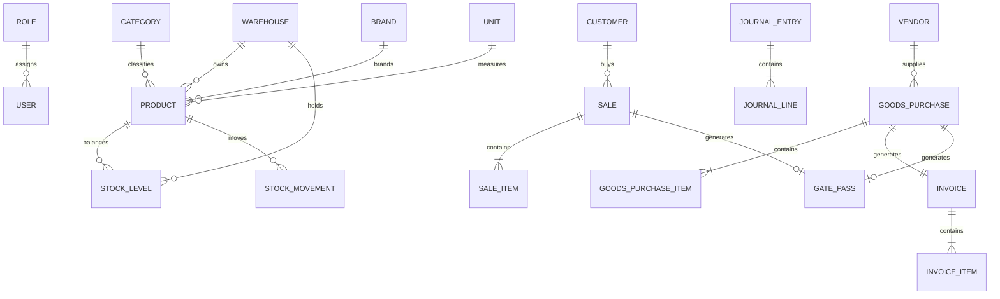

# PostgreSQL database

The backend uses PostgreSQL through Sequelize. Versioned migrations live in
`backend/src/db/migrations`, and runtime models/associations live in
`backend/src/db/models`.

Public IDs are compact 24-character hexadecimal strings generated by the
PostgreSQL application layer.
Money is integer paisa (`BIGINT`); quantities are whole-number `INTEGER` values,
and moving-average costs are `NUMERIC(30,12)`.

## Model organization

Each PostgreSQL table has its own Sequelize model file under
`backend/src/db/models`. For example, `saleModel.js` maps `sales`, while
`saleItemModel.js` maps the normalized `sale_items` child table.

- `index.js` initializes and exports the complete model registry.
- `associations.js` defines relationships and query aliases in one place.
- `helpers.js` contains shared ID, money, quantity, and serialization definitions.
- `*Model.js` files contain only the columns and options for their corresponding tables.

Application code should continue using:

```js
const { initializeModels } = require('./db/models');
const { Sale, SaleItem } = initializeModels();
```

## Main relationships


```mermaid
erDiagram
  ROLE ||--o{ USER : assigns
  WAREHOUSE ||--o{ PRODUCT : owns
  CATEGORY ||--o{ PRODUCT : classifies
  BRAND ||--o{ PRODUCT : brands
  UNIT ||--o{ PRODUCT : measures
  PRODUCT ||--o{ STOCK_LEVEL : balances
  WAREHOUSE ||--o{ STOCK_LEVEL : holds
  PRODUCT ||--o{ STOCK_MOVEMENT : moves
  CUSTOMER ||--o{ SALE : buys
  SALE ||--|{ SALE_ITEM : contains
  VENDOR ||--o{ GOODS_PURCHASE : supplies
  GOODS_PURCHASE ||--|{ GOODS_PURCHASE_ITEM : contains
  GOODS_PURCHASE ||--|| INVOICE : generates
  INVOICE ||--|{ INVOICE_ITEM : contains
  JOURNAL_ENTRY ||--|{ JOURNAL_LINE : contains
  SALE ||--o| GATE_PASS : generates
  GOODS_PURCHASE ||--o| GATE_PASS : generates
```

## Integrity rules

- One stock row per `(product_id, warehouse_id)`.
- At most one default warehouse.
- Product SKUs are unique when non-empty.
- Sale, purchase, invoice, and gate-pass numbers are unique.
- One purchase invoice per goods purchase.
- One gate pass per sale or purchase.
- Journal lines require exactly one positive debit/credit side.
- A deferred constraint verifies each journal entry has at least two balanced
  lines at transaction commit.
- Sale, purchase, invoice-payment, stock, journal, counter, and gate-pass
  changes are committed atomically.

## Commands

```bash
npm run db:migrate
npm run db:migrate:status
```
